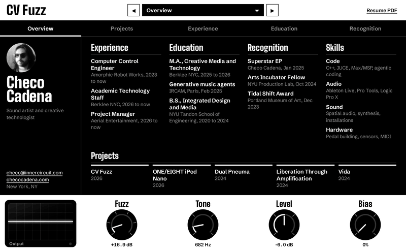
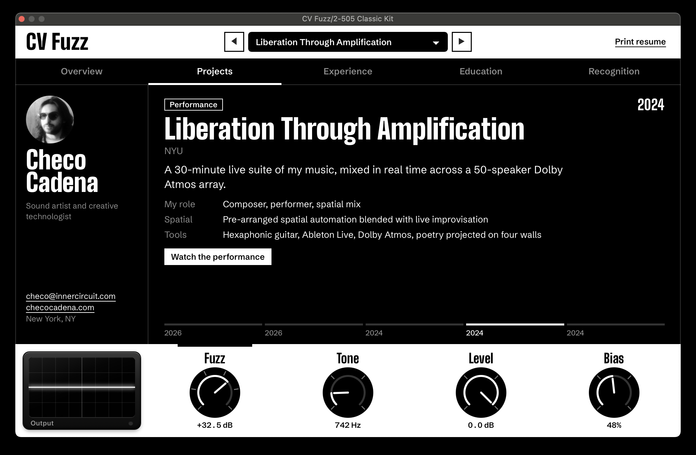
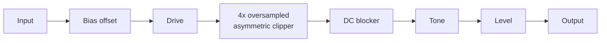
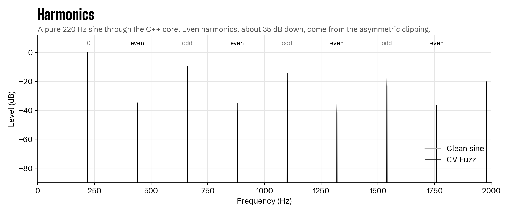
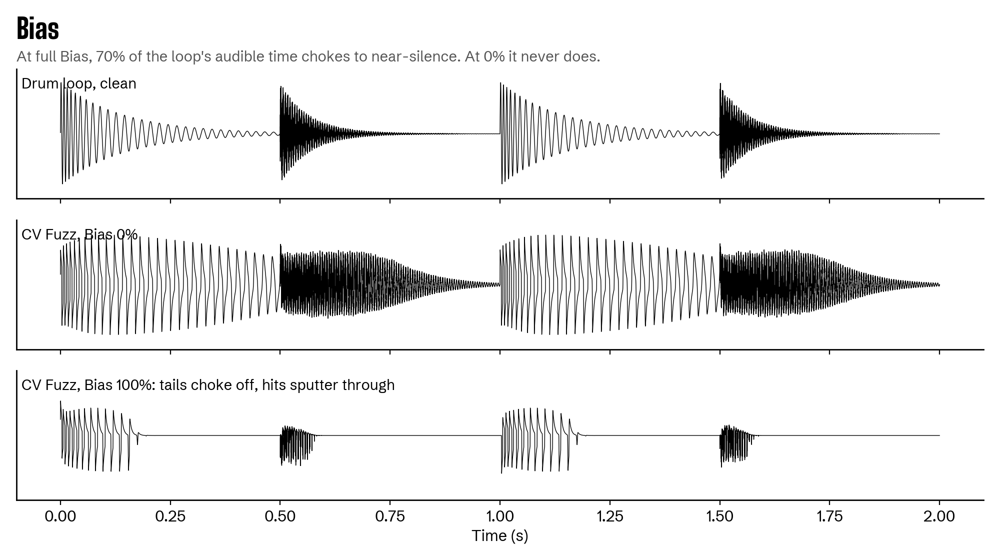

<div align="center">

# CV Fuzz

**A fuzz plugin and interactive resume by Checo Cadena.**

A C++ model of a fuzz pedal I designed and built at NYU. Each knob shapes the sound and opens a different part of my resume.

[**Download**](../../releases/latest) · [**Try it in your browser**](https://checocadena.github.io/cv-fuzz/demo/) · [**Website**](https://checocadena.github.io/cv-fuzz/)



</div>

## What it is

CV Fuzz is two things at once:

- **A fuzz plugin.** Asymmetric clipping, a starvable bias stage, 4x oversampling, and a tone control, written in C++ and built with JUCE as an Audio Unit, VST3, and standalone app.
- **An interactive résumé.** The interface is my CV. Turning a knob changes the sound and flips through one section: projects, experience, education, or recognition.

The name is a pun: in modular synthesis, CV is *control voltage*, the signal that moves a parameter.



## Install

Download from the [latest release](../../releases/latest):

| Platform | File | Formats |
| --- | --- | --- |
| macOS 11+ (Apple Silicon and Intel) | `CV-Fuzz-macOS.pkg`, signed and notarized | AU, VST3, standalone |
| Windows 10/11 (64-bit) | `CV-Fuzz-Windows-Setup.exe` | VST3, standalone |
| Linux x86-64 | `CV-Fuzz-Linux-x64.tar.gz`, then run `install.sh` | VST3, standalone |

On Windows, SmartScreen may warn about an unrecognized app because the installer isn't code-signed; choose More info > Run anyway. On Linux, the interface needs WebKitGTK 4.1 (`sudo apt install libwebkit2gtk-4.1-0`).

**In Ableton Live:** Settings > Plug-Ins, turn on Audio Units (Mac) and VST3, then click Rescan. CV Fuzz is under **Checo Cadena**.

## Controls

| Knob | What it does | Readout | Opens |
| --- | --- | --- | --- |
| **Fuzz** | Input drive into the clipper | 0 to +35.7 dB | Projects |
| **Tone** | Dark to bright | 500 Hz to 6 kHz | Experience |
| **Level** | Output volume | dB | Education |
| **Bias** | Starves the stage: tails gate out, hits sputter | 0 to 100% | Recognition |

The tick marks around each knob are detents, one per entry in its section. You can also navigate with the tabs, the preset browser at the top, or the arrow keys. Esc returns to the overview. All four knobs are automatable in your DAW.

## How the DSP works



The clipper flattens at +0.70 on top and -0.46 on the bottom. That asymmetry is what makes it sound like fuzz: a symmetric clipper creates only odd harmonics, while this one adds even harmonics too.



Bias shifts the operating point before the drive stage, like starving a transistor. Anything quieter than the offset gets pinned to one rail and turned into silence, so decays choke off while loud hits break through.



The full walkthrough, with the math for each stage, is in [**documentation/DSP.md**](documentation/DSP.md).

## Architecture

The DSP is a single framework-free C++ class. The interface is a web page running inside the plugin window through JUCE 8's WebView integration, bound to the real C++ parameters. The same HTML file runs in a browser with a Web Audio approximation, which is the online demo.

Details, including how the scope gets audio from the real-time thread to the UI without locks, are in [**documentation/ARCHITECTURE.md**](documentation/ARCHITECTURE.md).

## Build from source

On a Mac with Xcode Command Line Tools and CMake:

```
./build-mac.sh
```

This builds the AU, VST3, and standalone app, then installs the plugins to `~/Library/Audio/Plug-Ins`. Add `--installer` to also produce a `.pkg`. JUCE is downloaded automatically.

Windows and Linux builds are produced by GitHub Actions (`.github/workflows/release.yml`), which also shows the exact dependencies for each. To make a release, see [**documentation/RELEASING.md**](documentation/RELEASING.md).

## Project layout

```
Source/
  FuzzProcessor.h        the DSP core
  PluginProcessor.*      parameters and the audio callback
  PluginEditor.*         hosts the interface, binds it to the parameters
  ui/index.html          the interface (also the browser demo)
  assets/                résumé PDF
installer/               macOS installer definition and build script
documentation/           DSP, architecture, and release guides
docs/                    the website (GitHub Pages)
```

## Known limitations

The anti-aliasing filters are gentle, parameters aren't smoothed yet, and the clipper is a tuned waveshaper rather than a component-level model of the original circuit. The roadmap is at the end of [DSP.md](documentation/DSP.md#known-limitations-and-roadmap).

## About me

I'm Checo Cadena, a sound artist and creative technologist in New York. I lead the technology at Amorphic Robot Works, work on the technical staff at Berklee NYC, and trained in generative music systems at IRCAM in Paris.

[checocadena.com](https://checocadena.com) · checo@innercircuit.com

## License

The source code is MIT licensed. The résumé content, photos, and PDF are mine. See [LICENSE](LICENSE).
