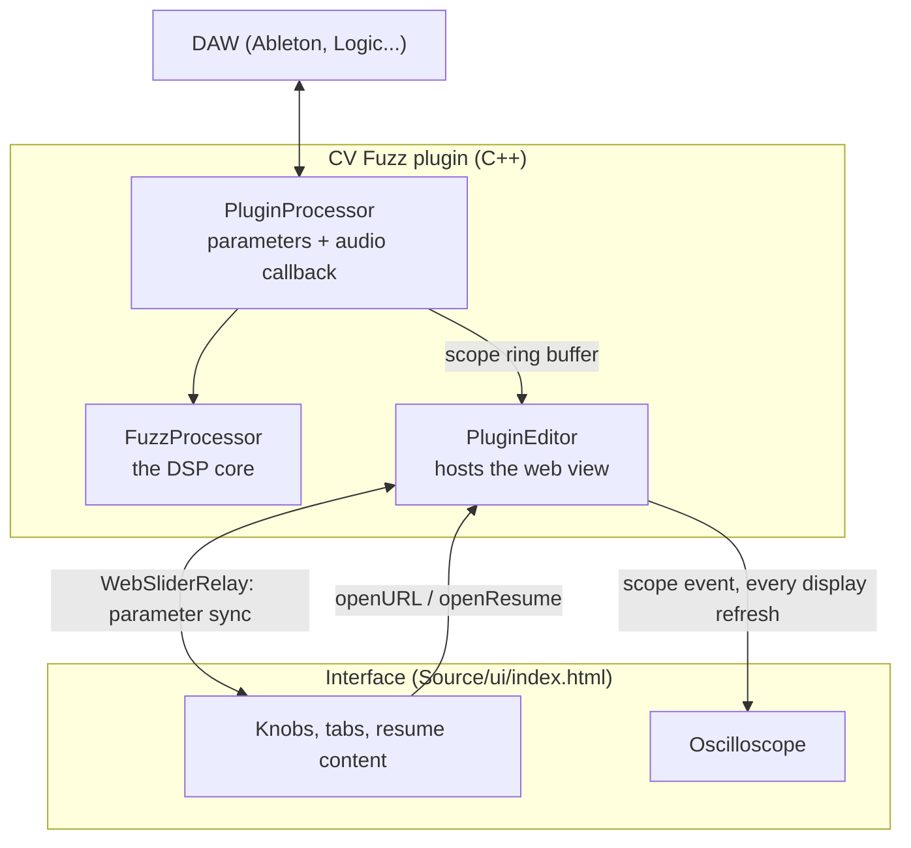

# Architecture

CV Fuzz is a standard JUCE 8 audio plugin with one unusual choice: its interface is a web page running inside the plugin window.

## Files

| File | Role |
| --- | --- |
| `Source/FuzzProcessor.h` | The DSP. Framework-free C++, documented in [DSP.md](DSP.md). |
| `Source/PluginProcessor.*` | Defines the five parameters (Fuzz, Tone, Level, Bias, Bypass) in an `AudioProcessorValueTreeState`, runs one `FuzzProcessor` per channel, and saves and restores state. |
| `Source/PluginEditor.*` | Creates the web view, serves the interface to it, binds knobs to parameters, and streams the scope. |
| `Source/ui/index.html` | The whole interface in one self-contained file. |
| `Source/assets/Checo_Cadena_Resume.pdf` | Opened by the Resume PDF button. |
| `installer/` | Builds the signed, notarized macOS installer. |

## Parameters and automation

The four knobs are `AudioParameterFloat`s from 0 to 1. Each is linked to the interface through a `juce::WebSliderRelay` and a `juce::WebSliderParameterAttachment`. Because the parameters live in the processor, not the interface, DAW automation, saved sessions, and undo all work normally. Automating a knob in Ableton moves it on screen.

## Serving the interface

The HTML, JUCE's JavaScript bridge, and the résumé PDF are compiled into the binary with `juce_add_binary_data`. A resource provider in `PluginEditor.cpp` serves them to the web view, so the plugin never needs network access or files on disk.

## The scope: audio thread to UI thread

The audio thread must never wait on a lock or allocate memory, so the scope uses a single-writer, single-reader ring buffer:

1. At the end of each `processBlock`, the audio thread copies the output into a 4,096-sample array and advances an `std::atomic<int>` write position.
2. On every display refresh (a `juce::VBlankAttachment`, so 60 Hz or 120 Hz depending on the screen), the UI thread reads backward from that position, finds a rising zero crossing so the waveform holds still, takes 220 points, and emits them to the page as an event.

The worst case is a torn read that shows one slightly glitched frame. It never affects the audio.

## Links and the résumé

A plugin window shouldn't navigate away from itself, so link clicks are intercepted in JavaScript and passed to a native `openURL` function, which calls `juce::URL::launchInDefaultBrowser()`. The Resume PDF button calls `openResume`, which writes the bundled PDF to a temp file and opens it in the system viewer.

## One interface, two runtimes

`Source/ui/index.html` also runs as a plain web page, which is what the online demo is. On load it checks for `window.__JUCE__`:

- **Inside the plugin:** it imports JUCE's bridge, binds the knobs to the C++ parameters, and draws the scope from the plugin's real output.
- **In a browser:** it builds a Web Audio approximation of the same signal chain and plays a short demo riff when you grab a knob.

The browser version is an approximation for previewing. The C++ is the real instrument.

## Why a web interface?

The interface is mostly typography, layout, and animated transitions between résumé sections, which HTML and CSS handle far better than hand-drawn JUCE components. The DSP stays entirely in C++, and the boundary between them is small: four parameters, one event stream, two native functions.
