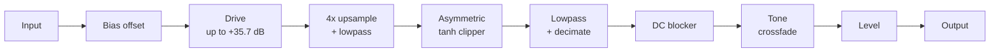
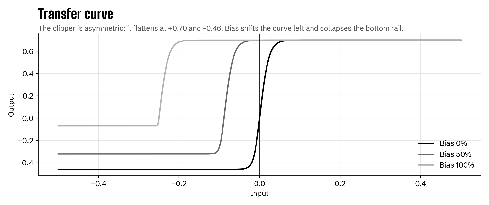

# How the DSP works

Everything below lives in [`Source/FuzzProcessor.h`](../Source/FuzzProcessor.h): a single, framework-free C++ class with no JUCE dependency. The plugin wraps it; a plain C++ test harness can run it on its own.

## Signal chain



Each sample goes through these stages in order. Parameters are read once per audio block.

## 1. Bias

Bias models a starved transistor, the "dying battery" sound. It does two things:

**It shifts the operating point before the drive stage.** An offset is added to the input:

```
starve = bias^1.5
x' = x + 0.25 * starve
```

Any part of the signal quieter than that offset can't swing past it, so it stays pinned to one side of the clipper. The DC blocker later turns that pinned level into silence. Drum tails and note decays choke off, while loud transients break through and sputter as they cross the threshold. The `^1.5` curve keeps the first half of the knob usable and saves the extreme behavior for the top.

**It collapses headroom on the negative side:**

```
negThresh = 0.46 * (1 - 0.85 * starve)
```

At full Bias the negative rail drops from 0.46 to about 0.07, pushing the stage toward half-wave rectification and adding a ragged edge.


Measured on a synthesized drum loop, at Fuzz 60%: at 50% Bias, 39% of the loop's audible time chokes to near-silence. At 100%, 70% does. At 0%, none does.

## 2. Drive

```
drive = 1 + 60 * fuzz
```

Linear gain from 1x to 61x, which is 0 to +35.7 dB. More gain pushes more of the signal into the clipper's flat regions.

## 3. Asymmetric clipper

```
y = 0.70 * tanh(x / 0.70)            for x >= 0
y = negThresh * tanh(x / negThresh)  for x < 0
```

`tanh` rounds the peaks off smoothly instead of chopping them flat. Using different thresholds for the positive and negative halves imitates real diodes and transistors, which don't conduct the same way in both directions.

That asymmetry is audible. A symmetric clipper only produces odd harmonics. An asymmetric one adds even harmonics too, which gives fuzz its thicker character. With a pure 220 Hz sine as input, the even harmonics sit about 35 dB below the fundamental, and they exist only because of the asymmetry:


The transfer curve shows the clipper's shape, and how Bias shifts it left and collapses the bottom rail:



## 4. Oversampling

Clipping creates new high frequencies. Anything above half the sample rate (Nyquist) can't be represented, so it folds back down into the audible range as inharmonic noise. That's aliasing.

To reduce it, the clipper runs at 4x the sample rate:

1. **Upsample** by zero-stuffing (one real sample followed by three zeros, scaled by 4), then lowpass to rebuild the waveform.
2. **Clip** at the higher rate, so new harmonics have room above the original Nyquist.
3. **Lowpass** again to remove everything the original rate can't hold, then keep one sample in four.

Both filters are second-order Butterworth lowpasses at 0.45x the original sample rate.

## 5. DC blocker

```
y[n] = x[n] - x[n-1] + 0.995 * y[n-1]
```

Asymmetric clipping and Bias both shift the waveform off center. A constant offset wastes headroom and causes clicks when the plugin is bypassed. This one-pole highpass removes it, with a cutoff around 38 Hz at 48 kHz.

## 6. Tone

```
cutoff = 500 * 12^tone              (500 Hz to 6 kHz)
out = tone * bright + (1 - tone) * lowpass(bright, cutoff)
```

A crossfade between the unfiltered signal and a lowpassed copy whose cutoff also rises with the knob. Low settings sound dark and woolly, high settings bright and cutting. It's a simplified stand-in for the passive RC tone network in a hardware pedal.

## 7. Level

Linear output gain from 0 to 1, shown in the interface in dB.

## Verification

A standalone C++ harness renders test signals through the class and writes WAV files, which a Python script analyzes:

- A pure sine, for the harmonic plot above.
- A synthesized plucked-string riff (Karplus-Strong), for listening tests on guitar-like material.
- A logarithmic sine sweep from 80 Hz to 2 kHz.
- A synthesized drum loop, for measuring how much Bias gates.

## Known limitations and roadmap

These are the next steps I'd take:

- **Steeper anti-aliasing.** One second-order filter at each end is gentle (12 dB per octave). A polyphase half-band design would suppress aliasing far more at high drive, for less CPU.
- **Parameter smoothing.** Parameters jump once per block, so fast automation can "zipper." Per-sample smoothing, like `juce::SmoothedValue`, would fix it.
- **Sample-rate-aware DC blocker.** The 0.995 coefficient is fixed, so the cutoff shifts slightly with sample rate. It should be computed from the rate.
- **A circuit-level model.** The clipper is a tuned waveshaper, not a component-level model of the original pedal. Solving the actual circuit, with the schematic's component values and transistor models, is the natural next version.
- **An RNBO version.** The same DSP as a Max/MSP RNBO patch, to compare the two toolchains and target hardware.
